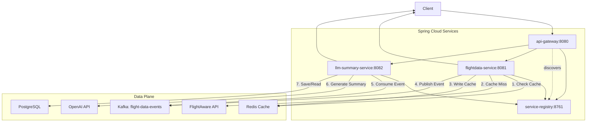

# System Architecture

## 1. Architecture Overview

This system is a distributed, event-driven microservice architecture following the Separation of Concerns (SoC) principle.

## 2. Microservice Definitions

| Microservice | Core Responsibility (SRP) | Key Technologies | Port |
|--------------|---------------------------|------------------|------|
| service-registry | Service registration and discovery | Spring Boot, Eureka Server | 8761 |
| api-gateway | Single entry point; routes requests | Spring Boot, Spring Cloud Gateway | 8080 |
| flightdata-service | Fetches flight data; caches in Redis; publishes to Kafka | Spring Boot, WebClient, Redis, Kafka | 8081 |
| llm-summary-service | Consumes Kafka events; generates summaries via OpenAI; saves to PostgreSQL | Spring Boot, Kafka Consumer, OpenAI API, JPA | 8082 |

## 3. System Design Diagram (Mermaid)



## 4. Request Flows

### Flow 1: Get Real-Time Flight Data (Cache-Aside Pattern)

1. User sends GET `/api/v1/flight/UAL123` to api-gateway
2. api-gateway discovers flightdata-service via Eureka and routes request
3. flightdata-service checks Redis cache for key `flight:UAL123`
4. **Cache Hit:** Return cached JSON immediately (< 500ms)
5. **Cache Miss:** 
   - Call FlightAware AeroAPI
   - Save response to Redis (TTL: 5 minutes)
   - Publish `flight-data-events` event to Kafka
   - Return JSON to user

### Flow 2: Get LLM Summary (Event-Driven & Asynchronous)

1. llm-summary-service listens to Kafka topic `flight-data-events`
2. On new event, consumes FlightData JSON
3. Formats data into LLM prompt template
4. Sends prompt to OpenAI API (gpt-3.5-turbo)
5. Saves generated summary to PostgreSQL
6. **User Request:** GET `/api/v1/flight/UAL123/summary`
7. llm-summary-service reads pre-generated summary from DB
8. Returns FlightSummary JSON instantly

## 5. Database Schemas

### PostgreSQL Schema (llm-summary-service)

```sql
CREATE TABLE flight_summaries (
    id SERIAL PRIMARY KEY,
    ident VARCHAR(50) NOT NULL,
    fa_flight_id VARCHAR(100) NOT NULL UNIQUE,
    summary_text TEXT,
    generated_at TIMESTAMPTZ DEFAULT CURRENT_TIMESTAMP,
    last_updated_at TIMESTAMPTZ DEFAULT CURRENT_TIMESTAMP
);

CREATE INDEX idx_ident ON flight_summaries(ident);
```

### Kafka Event Schema

**Topic:** `flight-data-events`  
**Message Format:** FlightData JSON (from API-SPEC.yml)

**Sample Event:**

```json
{
  "fa_flight_id": "UAL123-1678886400-airline-0123",
  "ident": "UAL123",
  "status": "En-Route / In Flight",
  "scheduled_out": "2023-03-15T12:00:00Z",
  "actual_out": "2023-03-15T12:05:00Z",
  "scheduled_in": "2023-03-15T18:30:00Z",
  "actual_in": null,
  "origin": "KORD",
  "destination": "KLAX",
  "aircraft_type": "B738",
  "latitude": 39.8,
  "longitude": -98.6,
  "altitude": 35000,
  "groundspeed": 450
}
```

### Redis Cache Schema

**Key Pattern:** `flight:{ident}`  
**Example:** `flight:UAL123`  
**Value:** FlightData JSON  
**TTL:** 300 seconds (5 minutes)

**Sample Cache Entry:**

```json
{
  "fa_flight_id": "UAL123-1678886400-airline-0123",
  "ident": "UAL123",
  "status": "En-Route / In Flight",
  "scheduled_out": "2023-03-15T12:00:00Z",
  "actual_out": "2023-03-15T12:05:00Z",
  "scheduled_in": "2023-03-15T18:30:00Z",
  "actual_in": null,
  "origin": "KORD",
  "destination": "KLAX",
  "aircraft_type": "B738",
  "latitude": 39.8,
  "longitude": -98.6,
  "altitude": 35000,
  "groundspeed": 450
}
```
